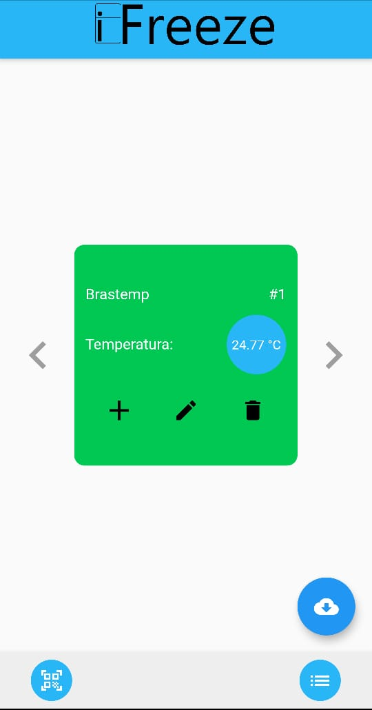
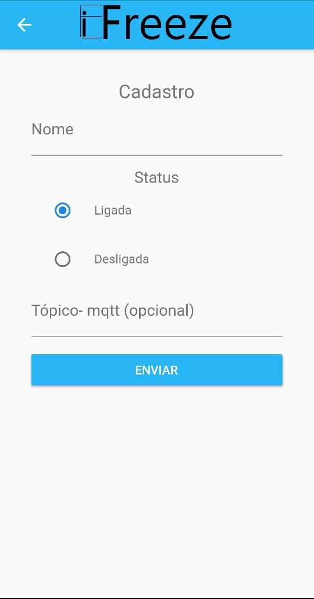
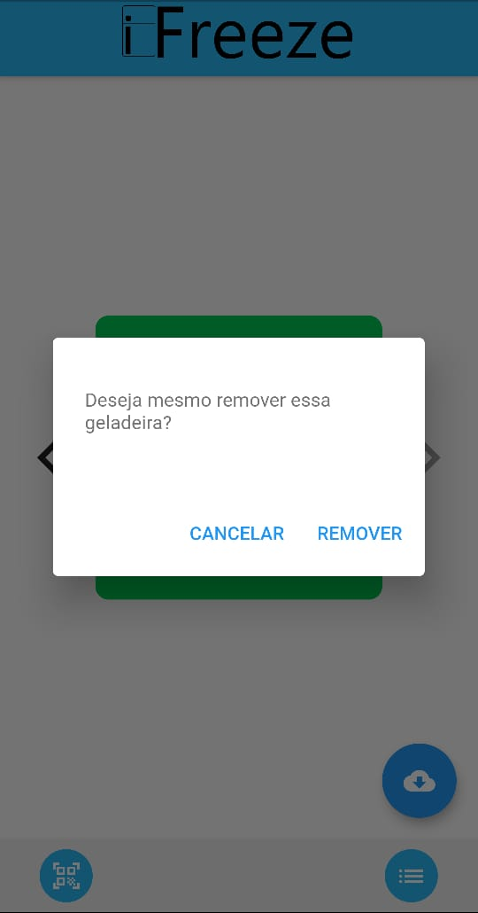
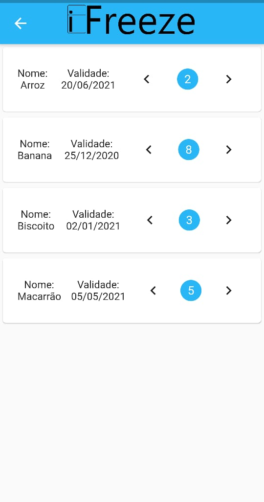

# iFreeze
   Trabalho final da disciplina de Laboratório de Desenvolvimento de Dispositivos Móveis. Feito por: Arthur Bernardo, Arthur Firmiano, Gabriel Costa, Lizandra Ruiz e Lucas Baesse.
   
   O aplicativo tem como finalidade gerenciar listas de produtos contidos em geladeiras. Além disso, o aplicativo mostra ao usuário a temperatura da geladeira cadastrada em tempo real.
   
# Vídeo demonstrativo
 https://www.youtube.com/watch?v=HdsYw6JwXJc
 
# Funcionalidades
  Na página inicial o usuário pode cadastrar, editar e remover geladeiras aos dados do aplicativo. Além disso, pode selecionar uma geladeira e adicionar produtos a ela por meio da leitura de um QRcode. A temperatura é medida por um sensor inserido na geladeira e é retornada por um protocolo MQTT. Na página de listagem dos produtos da geladeira, o usuário pode aumentar e diminuir a quantidade do produto, caso o produto tenha quantidade 0 ele é automaticamente excluído da lista.
  
  Exemplo do conteúdo textual do QRcode: {"nome":"Banana","quantidade":10,"validade":"25/12/2020"}

# Fotos
      
      

# Documentação e especificações técnicas
  O aplicativo foi realizado utilizando o modelo de projetos MVC, para persistir os dados foi utilizado o SQLite e para o gerenciamento de estados utilizamos o Provider.
  
  1. main.dart - Ponto de partida do aplicativo 
  
  models
  <ol>
    <li>iFreeze.Comida.model.dart - define o modelo de dados Comida</li>
    <li>iFreeze.Geladeira.model.dart - define o modelo de dados Geladeira</li>
  </ol>
 
  repositories
  <ol>
    <li>iFreeze.Comida.database.dart, iFreeze.Comida.database.g.dart, iFreeze.Comida.repository.dart e iFreeze.ComidaDao.dart - armazena e recupera os dados referentes ao modelo Comida</li>
    <li>iFreeze.Geladeira.database.dart, iFreeze.Geladeira.database.g.dart, iFreeze.Geladeira.repository.dart e iFreeze.GeladeiraDao.dart - armazena e recupera os dados referentes ao modelo Geladeira</li>
    <li>iFreeze.MQTT.repository.dart - solicia e armazena a temperatura do sensor</li>
  </ol>
  
  controllers
  <ol>
    <li>iFreeze.Comida.controller.dart - controla os dados referentes ao modelo Comida no aplicativo</li>
    <li>iFreeze.Geladeira.controller.dart- controla os dados referentes ao modelo Geladeira no aplicativo</li>
    <li>iFreeze.MQTT.controller.dart- controla os dados referentes ao sensor de temperatura</li>
  </ol>
 
  views
    <ol>
    <li>iFreeze.HomePage.view.dart - compõe a tela principal</li>
    <li>iFreeze.CadastroPage.view.dart - compõe a tela de cadastro do modelo Geladeira</li>
    <li>iFreeze.EditarPage.view.dart - compõe a tela de editar do modelo Geladeira</li>
    <li>iFreeze.ListPage.view.dart - compõe a tela de listagem de produtos do modelo Comida</li>
  </ol>
  
# Download do APK
https://drive.google.com/file/d/1HMvaXkiNbdan8vOFg0fo99rMfP0EaC8z/view?usp=sharing

  
  

